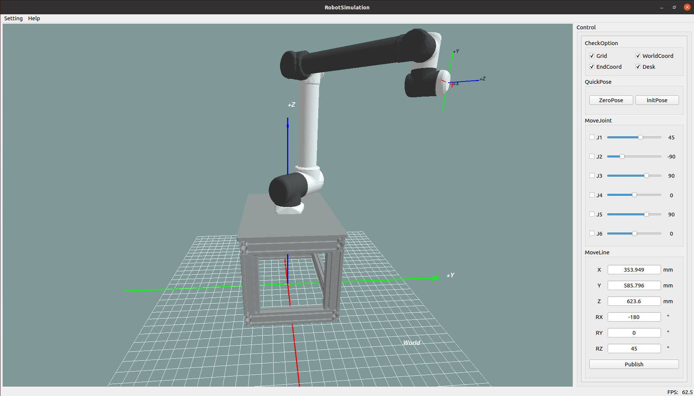

<h1 align="center">
  RobotSimulation 🦾
</h1>

<p align="center">
  Robot arm control software based on Qt Widget implementation, this project is mainly used to learn the use of OpenGL
</p>

<div align=center>
  
</div>

## Requirements
```
* The project was built and tested on the Ubuntu 20.04 operating system.
* Theoretically can be built and run on the Windows operating system. 
* But it should be noted that please use the Qt 5.x version, otherwise there may be interface changes!
```
+ GCC
+ Qt5.15.2

## Get started

* Clone the repository.

  ```SHELL
  git clone https://github.com/RichaoWang/RobotSimulationDemo.git
  ```

* Build

  > 1.Open CMakeLists.txt with Qt Creator/ Clion.
  >
  >2.build & run it!
