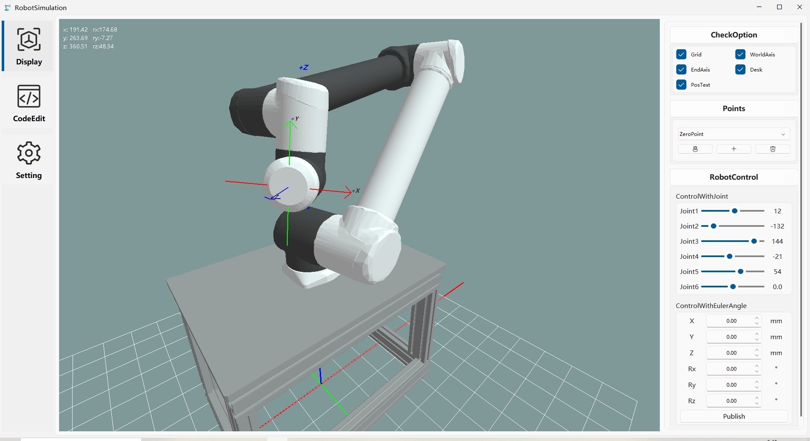

<h1 align="center">
  RobotSimulation 🦾
</h1>

<p align="center">
The robot arm control software is implemented based on Qt Widget. This project is mainly used to learn the use of OpenGL and learn robot kinematics
</p>
<div align=center>
  
</div>


<p align="center">
<a ></a>
<a ></a>
<a href="https://en.wikipedia.org/wiki/C%2B%2B"></a>
<a href="https://en.wikipedia.org/wiki/MIT_License"></a>
</p>

## Requirements

+ Qt5+

## Get started

* Clone the repository.

  ```SHELL
  git clone https://github.com/RichaoWang/RobotSimulation.git
  ```

* Build

  > 1.Open CMakeLists.txt with Qt Creator/ Clion.
  >
  >2.build & run it!

## Reference

> * [ros-industrial/universal_robot](https://github.com/ros-industrial/universal_robot): Universal Robots support.
> * [mowangshuying/CppQtFluentUi888](https://github.com/mowangshuying/CppQtFluentUi888): FluentUI for cpp Qt.
> * [wangwenx190/framelesshelper](https://github.com/wangwenx190/framelesshelper): Cross-platform window customization
    framework for Qt Widgets and Qt Quick.
> * [Megaxela/QCodeEditor](https://github.com/Megaxela/QCodeEditor): Qt Code Editor widget.

## TodoList

+ [x] ~~NewUi~~
+ [x] ~~FK~~
+ [x] ~~IK~~
+ [x] ~~MoveAnimations~~
+ [ ] Program
+ [ ] Cn/En
